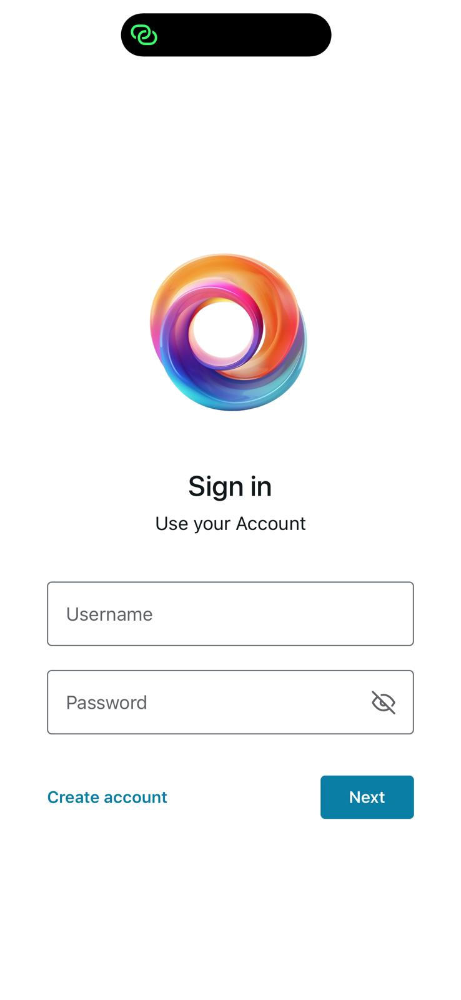
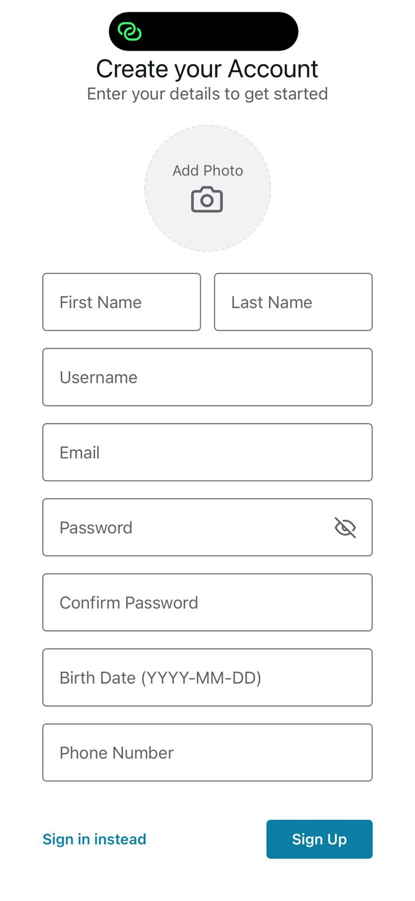
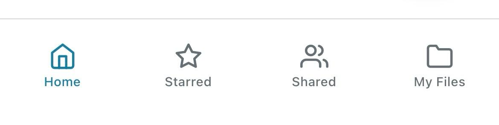
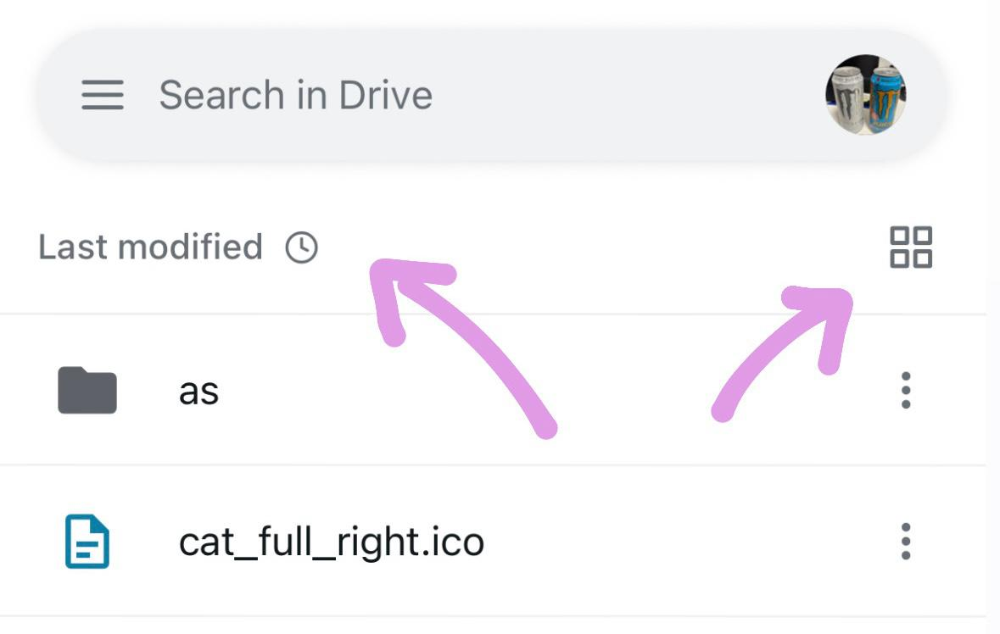
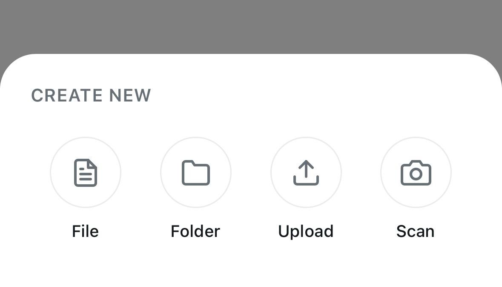
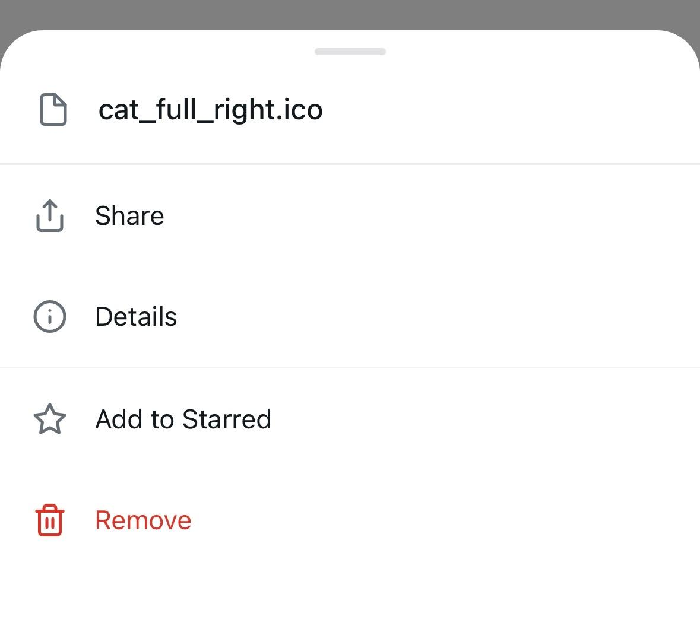
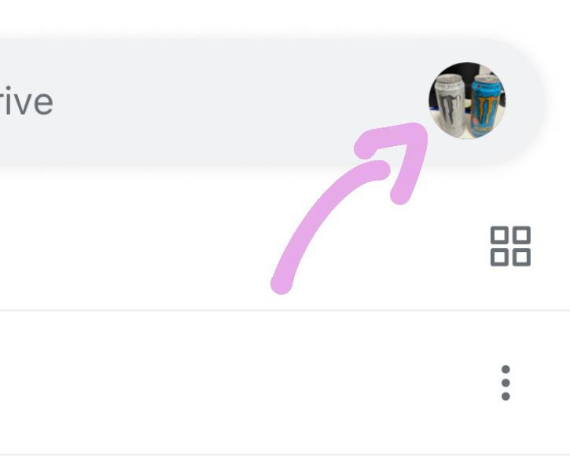
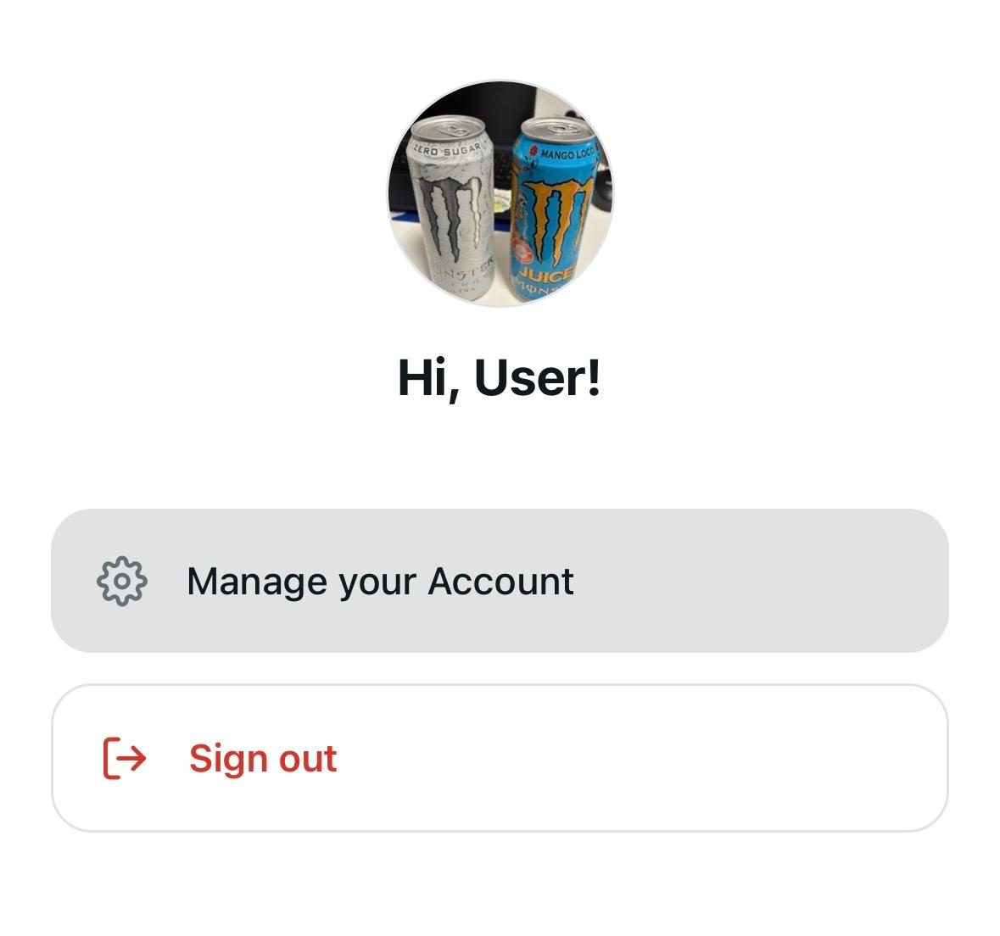
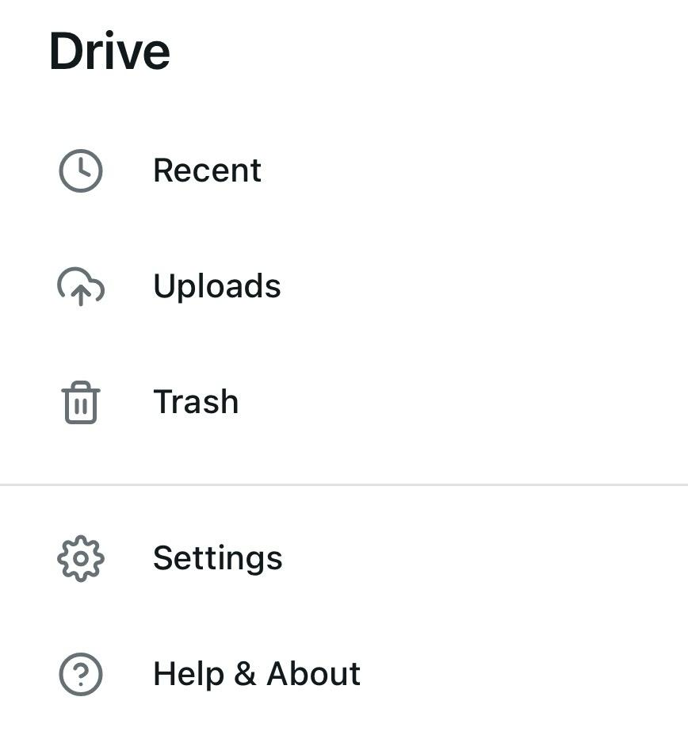
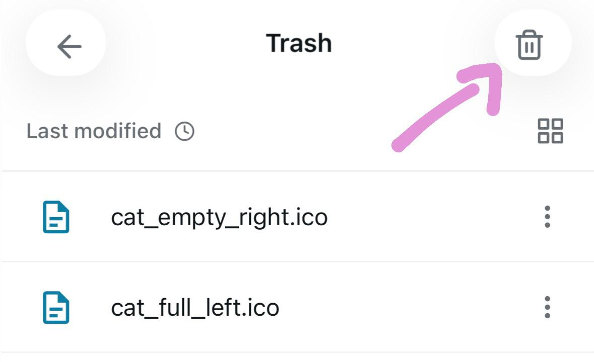

# 📱 How-To-Use: Mobile App

This guide walks you through the features and navigation of the Drive mobile application.

---

## 🔑 1. Authentication Screen
When you first launch the app, you are greeted by the **Login** screen.
* **Sign Up:** Enter your information to create an account. This data is stored in the database servers.
* **Sign In:** Use your credentials to access your personal file storage.
* **Validation:** The app will show an error if your information is in an invalid format.

---

## 🏠 2. Dashboard (Main Files View)
Once logged in, you land on the **Home** dashboard.
* **File List:** A scrollable list of all files you have uploaded.
* **File Icons:** Different icons appear based on file type (e.g., Folder or Generic File).
* **Search Bar:** Find a desired file by searching its name or content.
  ### Tabs:
  * **Home:** Main tab, includes all the files accesible to you.
  * **Starred:** Includes all the files you marked as starred.
  * **Shared:** Includes all the files that were shared to you.
  * **My Files:** Includes all the files you own.

---

## 👀 3. Viewing/Sorting options:
In each tab, you may sort/view your files as you desire.
  * **List/Grid View:** Change the appearence of your file items by clicking on the top right icon.
  * **Name/Time Sort:** Change the order of your files by time of creation, or by alphabetical order.
  * **Dark/Light Mode:** Changed automatically based on your phone settings.
    

---

## 📤 4. Uploading/Creating Files
To add a new file to your cloud storage:
*  **The "+" Button:** Tap the floating action button at the bottom right.
*  **File Picker:** This opens your phone's native file explorer (iOS Files or Android Documents).
*  **Create File:** Manually create a text file by entering the filename and desired content.
*  **Create Folder:** Manually create a folder by entering the folder name.
*  **View File:** Click on a file to view it (image files). Text files can be edited and saved.
*  **Scan File:** Opens your device camera and lets you take a picture and upload it to the app.

---

## 📁 5. File Actions (Three dot menu)
Each file in the list has a "more" menu (three dots) or responds to a long press:
* **Star:** Adds the file to the "starred" page.
* **Remove:** Removes the file permanently.
* **Details:** View file size, upload date, and file extension.
* **Share:** Send a file to another user by typing their username.
 
---

## ⚙️ 6. Settings & Profile
Accessible via the avatar icon in the top header:
* **Manage your profile:** Edit your information.
* **Logout:** Securely end your session and return to the Login screen.
* 

---

## 📜 7. Side Menu
Accessible via the three bar icon in the top bar.
* **Recent:** View your most recently edited/created files.
* **Trash:** View your deleted files, restore or permanently delete them from the three dot icon.
    Empty all trash files by clicking on the top right trash icon.
* **Uploads:** View all the files you uploaded.
* **Settings:** Edit your account information.
* **Help and about:** General information about the app, contact us option.

---

## 💻 8. Cross-Platform Behavior
* **iOS/Android:** The UI adjusts automatically to match the system's look and feel (using `Platform.select`).
* **Web View:** If you run the web version of the app, the layout expands to a sidebar-style dashboard.

---

## 💡 Quick Tips
* **No Connection?** If the app stays on the loading spinner, check the [Troubleshooting Guide](./troubleshooting.md) to verify your `HOST_IP`.
* **Large Files:** For files over 50MB, ensure you are on a stable Wi-Fi connection as the C++ server processes the data in chunks.
